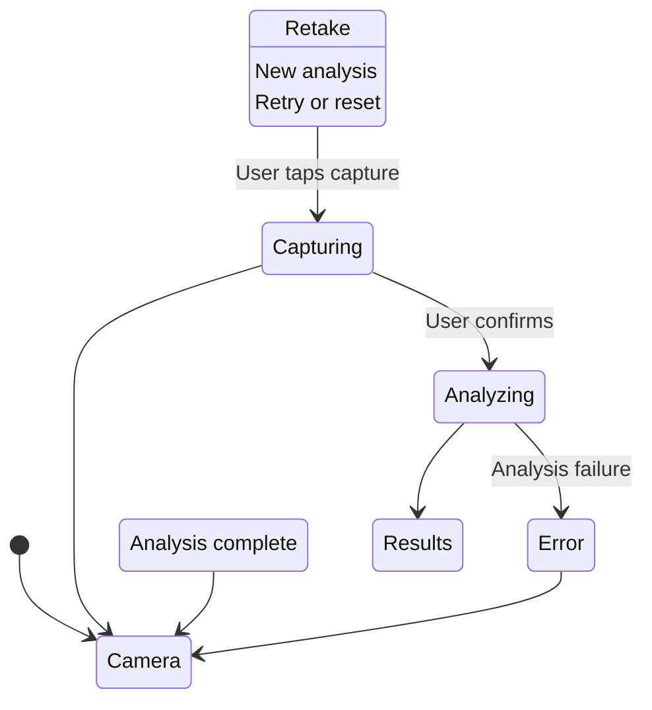

# Data Model: Camera Food Capture & Analysis

**Feature**: Camera Food Capture & Analysis
**Created**: 2025-11-09
**Status**: Draft

## Overview

This document defines the core data entities and their relationships for the camera food capture and analysis feature. The data model supports the mobile-first PWA architecture with secure backend processing.

## Core Entities

### FoodItem
Represents an individual food item identified by AI analysis.

```typescript
interface FoodItem {
  id: string;                    // Unique identifier (UUID)
  name: string;                  // Food name (e.g., "Grilled Chicken Breast")
  calories: number;              // Calorie count (number)
  confidence: number;            // Confidence score (0.0 - 1.0, min 0.90)
  cookingMethod: CookingMethod;  // Preparation method
  portionEstimate?: string;      // Portion size description
  nutritionInfo?: NutritionInfo; // Additional nutritional data
}
```

### CookingMethod
Enumeration of supported cooking methods as specified in clarifications.

```typescript
enum CookingMethod {
  FRIED = 'fried',
  BAKED = 'baked',
  GRILLED = 'grilled',
  STEAMED = 'steamed',
  RAW = 'raw'
}
```

### NutritionInfo
Optional detailed nutritional information for food items.

```typescript
interface NutritionInfo {
  protein: number;     // Grams
  carbs: number;       // Grams
  fat: number;         // Grams
  fiber: number;       // Grams
  sodium?: number;     // Milligrams
  cholesterol?: number; // Milligrams
}
```

### AnalysisResult
Container for the complete analysis response from AI.

```typescript
interface AnalysisResult {
  foods: FoodItem[];              // Array of identified foods (max 5 items)
  totalCalories: number;          // Sum of all food calories
  confidence: number;             // Overall confidence score
  processingTimeMs: number;       // Processing duration
  metadata: AnalysisMetadata;     // Response metadata
}
```

### AnalysisMetadata
Technical metadata about the analysis request.

```typescript
interface AnalysisMetadata {
  model: string;                  // AI model used (e.g., "gemini-1.5-flash")
  timestamp: string;              // ISO timestamp of analysis
  requestId?: string;             // Optional request identifier
  version: string;                // Response format version
}
```

## Request/Response Models

### AnalysisRequest
Data structure sent from frontend to backend.

```typescript
interface AnalysisRequest {
  image: string;                  // Base64-encoded image data
  sessionId?: string;             // Optional session identifier
  preferences?: UserPreferences;  // Optional user preferences
}
```

### AnalysisResponse
Structured response from backend to frontend.

```typescript
interface AnalysisResponse {
  success: boolean;
  data?: AnalysisResult;
  error?: ErrorInfo;
  metadata: ResponseMetadata;
}
```

### ErrorInfo
Consistent error information structure.

```typescript
interface ErrorInfo {
  code: string;                   // Machine-readable error code
  message: string;                // Human-readable error message
  retryable: boolean;             // Whether the operation can be retried
  details?: Record<string, any>;  // Additional error context
}
```

### ResponseMetadata
Standard response metadata.

```typescript
interface ResponseMetadata {
  timestamp: string;
  version: string;
  processingTimeMs: number;
}
```

## UI State Models

### CameraState
Camera component state management.

```typescript
interface CameraState {
  status: CameraStatus;
  stream?: MediaStream;
  error?: ErrorInfo;
  permissions: PermissionStatus;
}

enum CameraStatus {
  INITIALIZING = 'initializing',
  READY = 'ready',
  CAPTURING = 'capturing',
  ERROR = 'error'
}

enum PermissionStatus {
  UNKNOWN = 'unknown',
  GRANTED = 'granted',
  DENIED = 'denied',
  PROMPT = 'prompt'
}
```

### LoadingState
Loading and progress tracking for AI analysis.

```typescript
interface LoadingState {
  isLoading: boolean;
  progress?: ProgressInfo;
  stage: LoadingStage;
}

interface ProgressInfo {
  percentage: number;             // 0-100
  timeRemaining?: number;         // Seconds remaining
  currentStage: string;           // Current operation description
}

enum LoadingStage {
  PREPARING = 'preparing',
  UPLOADING = 'uploading',
  ANALYZING = 'analyzing',
  COMPLETING = 'completing'
}
```

## Validation Rules

### FoodItem Validation
- `name`: Required, non-empty string, max 100 characters
- `calories`: Required, positive number, max 10000
- `confidence`: Required, number 0.0-1.0, minimum 0.90 per spec clarification
- `cookingMethod`: Required, must be one of defined CookingMethod values
- `id`: Required, valid UUID format

### Image Validation
- `image`: Required, base64 format with image/jpeg, image/png, or image/webp MIME type
- Maximum file size: 4MB (4 * 1024 * 1024 bytes)
- Minimum dimensions: 200x200 pixels
- Maximum dimensions: 3840x2160 pixels

### Response Validation
- `foods`: Array with 1-5 items (empty array allowed if no food detected)
- `totalCalories`: Non-negative number (0 if no foods detected)
- `processingTimeMs`: Positive number, max 30000 (30 seconds)
- `success`: Required boolean
- `metadata`: Required with valid timestamp

## Data Flow

### Frontend to Backend Flow
1. **Capture**: Camera → Canvas → Base64 Image
2. **Request**: AnalysisRequest with image data
3. **Processing**: Backend AI analysis
4. **Response**: AnalysisResponse with structured results
5. **Display**: UI renders food items and totals

### State Transitions


## Storage Considerations

### Client-Side Storage
- **Session Storage**: Temporary image data during analysis
- **Local Storage**: User preferences and recent analysis history
- **No Persistent Images**: Images not stored per privacy requirements

### Server-Side Considerations
- **Stateless Functions**: No persistent storage in Vercel functions
- **Environment Variables**: API keys secure in Vercel environment
- **Optional Cache**: External cache could store frequent analysis results

## Performance Constraints

### Client-Side
- Image capture: < 2 seconds
- Image preparation: < 1 second
- UI responsiveness: < 100ms for interactions

### Server-Side
- Request validation: < 100ms
- AI processing: < 10 seconds (95th percentile)
- Response generation: < 200ms

### Memory Constraints
- Client: Image data < 10MB in memory
- Server: Function memory < 1GB (Vercel Pro)
- Buffer sizes: Configured for base64 processing

## Error Handling Data

### Error Codes
```typescript
enum ErrorCode {
  // Camera errors
  CAMERA_PERMISSION_DENIED = 'CAMERA_PERMISSION_DENIED',
  CAMERA_NOT_FOUND = 'CAMERA_NOT_FOUND',
  CAMERA_IN_USE = 'CAMERA_IN_USE',

  // Analysis errors
  IMAGE_TOO_LARGE = 'IMAGE_TOO_LARGE',
  INVALID_IMAGE_FORMAT = 'INVALID_IMAGE_FORMAT',
  ANALYSIS_TIMEOUT = 'ANALYSIS_TIMEOUT',
  AI_SERVICE_ERROR = 'AI_SERVICE_ERROR',

  // Network errors
  NETWORK_OFFLINE = 'NETWORK_OFFLINE',
  REQUEST_TIMEOUT = 'REQUEST_TIMEOUT',
  SERVER_ERROR = 'SERVER_ERROR'
}
```

### Retry Logic
- **Retryable Errors**: Network timeout, AI service temporarily unavailable
- **Non-Retryable**: Invalid image format, permission denied, quota exceeded
- **Max Retries**: 3 attempts with exponential backoff

## Extensibility

### Future Enhancements
- **Multiple Serving Sizes**: Add portion scaling based on user input
- **Nutrition Tracking**: Historical meal tracking features
- **Recipe Recognition**: Identify prepared dishes vs individual ingredients
- **Allergen Detection**: Flag common allergens in identified foods

### API Versioning
- Current version: v1.0.0
- Backward compatibility maintained for minor versions
- Breaking changes require major version increment